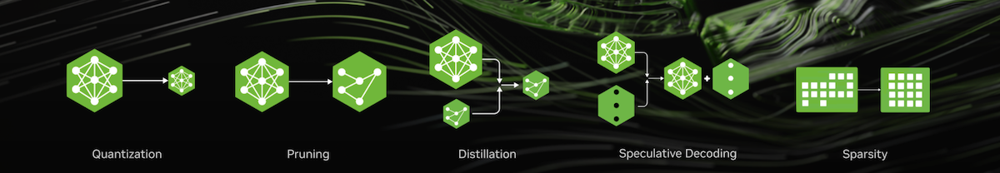

<div align="center">



# NVIDIA TensorRT Model Optimizer

[](https://nvidia.github.io/TensorRT-Model-Optimizer)
[](https://pypi.org/project/nvidia-modelopt/)
[](./LICENSE)

[Documentation](https://nvidia.github.io/TensorRT-Model-Optimizer) |
[Roadmap](https://github.com/NVIDIA/TensorRT-Model-Optimizer/issues/146)

</div>

______________________________________________________________________

The **NVIDIA TensorRT Model Optimizer** (referred to as **Model Optimizer**, or **ModelOpt**) is a library comprising state-of-the-art model optimization [techniques](#techniques) including quantization, distillation, pruning, speculative decoding and sparsity to accelerate models.

**[Input]** Model Optimizer currently supports inputs of a [Hugging Face](https://huggingface.co/), [PyTorch](https://github.com/pytorch/pytorch) or [ONNX](https://github.com/onnx/onnx) model.

**[Optimize]** Model Optimizer provides Python APIs for users to easily compose the above model optimization techniques and export an optimized quantized checkpoint.
Model Optimizer is also integrated with [NVIDIA NeMo](https://github.com/NVIDIA-NeMo/NeMo), [Megatron-LM](https://github.com/NVIDIA/Megatron-LM) and [Hugging Face Accelerate](https://github.com/huggingface/accelerate) for training required inference optimization techniques.

**[Export for deployment]** Seamlessly integrated within the NVIDIA AI software ecosystem, the quantized checkpoint generated from Model Optimizer is ready for deployment in downstream inference frameworks like [SGLang](https://github.com/sgl-project/sglang), [TensorRT-LLM](https://github.com/NVIDIA/TensorRT-LLM/tree/main/examples/quantization), [TensorRT](https://github.com/NVIDIA/TensorRT), or [vLLM](https://github.com/vllm-project/vllm).

## Latest News

- [2025/09/17] [An Introduction to Speculative Decoding for Reducing Latency in AI Inference](https://developer.nvidia.com/blog/an-introduction-to-speculative-decoding-for-reducing-latency-in-ai-inference/)
- [2025/09/11] [How Quantization Aware Training Enables Low-Precision Accuracy Recovery](https://developer.nvidia.com/blog/how-quantization-aware-training-enables-low-precision-accuracy-recovery/)
- [2025/08/29] [Fine-Tuning gpt-oss for Accuracy and Performance with Quantization Aware Training](https://developer.nvidia.com/blog/fine-tuning-gpt-oss-for-accuracy-and-performance-with-quantization-aware-training/)
- [2025/08/01] [Optimizing LLMs for Performance and Accuracy with Post-Training Quantization](https://developer.nvidia.com/blog/optimizing-llms-for-performance-and-accuracy-with-post-training-quantization/)
- [2025/06/24] [Introducing NVFP4 for Efficient and Accurate Low-Precision Inference](https://developer.nvidia.com/blog/introducing-nvfp4-for-efficient-and-accurate-low-precision-inference/)
- [2025/05/14] [NVIDIA TensorRT Unlocks FP4 Image Generation for NVIDIA Blackwell GeForce RTX 50 Series GPUs](https://developer.nvidia.com/blog/nvidia-tensorrt-unlocks-fp4-image-generation-for-nvidia-blackwell-geforce-rtx-50-series-gpus/)
- [2025/04/21] [Adobe optimized deployment using TensorRT-Model-Optimizer + TensorRT leading to a 60% reduction in diffusion latency, a 40% reduction in total cost of ownership](https://developer.nvidia.com/blog/optimizing-transformer-based-diffusion-models-for-video-generation-with-nvidia-tensorrt/)
- [2025/04/05] [NVIDIA Accelerates Inference on Meta Llama 4 Scout and Maverick](https://developer.nvidia.com/blog/nvidia-accelerates-inference-on-meta-llama-4-scout-and-maverick/). Check out how to quantize Llama4 for deployment acceleration [here](./examples/llm_ptq/README.md#llama-4)
- [2025/03/18] [World's Fastest DeepSeek-R1 Inference with Blackwell FP4 & Increasing Image Generation Efficiency on Blackwell](https://developer.nvidia.com/blog/nvidia-blackwell-delivers-world-record-deepseek-r1-inference-performance/)
- [2025/02/25] Model Optimizer quantized NVFP4 models available on Hugging Face for download: [DeepSeek-R1-FP4](https://huggingface.co/nvidia/DeepSeek-R1-FP4), [Llama-3.3-70B-Instruct-FP4](https://huggingface.co/nvidia/Llama-3.3-70B-Instruct-FP4), [Llama-3.1-405B-Instruct-FP4](https://huggingface.co/nvidia/Llama-3.1-405B-Instruct-FP4)
- [2025/01/28] Model Optimizer has added support for NVFP4. Check out an example of NVFP4 PTQ [here](./examples/llm_ptq/README.md#model-quantization-and-trt-llm-conversion).
- [2025/01/28] Model Optimizer is now open source!
- [2024/10/23] Model Optimizer quantized FP8 Llama-3.1 Instruct models available on Hugging Face for download: [8B](https://huggingface.co/nvidia/Llama-3.1-8B-Instruct-FP8), [70B](https://huggingface.co/nvidia/Llama-3.1-70B-Instruct-FP8), [405B](https://huggingface.co/nvidia/Llama-3.1-405B-Instruct-FP8).
- [2024/09/10] [Post-Training Quantization of LLMs with NVIDIA NeMo and TensorRT Model Optimizer](https://developer.nvidia.com/blog/post-training-quantization-of-llms-with-nvidia-nemo-and-nvidia-tensorrt-model-optimizer/).

<details close>
<summary>Previous News</summary>

- [2024/08/28] [Boosting Llama 3.1 405B Performance up to 44% with TensorRT Model Optimizer on NVIDIA H200 GPUs](https://developer.nvidia.com/blog/boosting-llama-3-1-405b-performance-by-up-to-44-with-nvidia-tensorrt-model-optimizer-on-nvidia-h200-gpus/)
- [2024/08/28] [Up to 1.9X Higher Llama 3.1 Performance with Medusa](https://developer.nvidia.com/blog/low-latency-inference-chapter-1-up-to-1-9x-higher-llama-3-1-performance-with-medusa-on-nvidia-hgx-h200-with-nvlink-switch/)
- [2024/08/15] New features in recent releases: [Cache Diffusion](https://github.com/NVIDIA/TensorRT-Model-Optimizer/tree/main/examples/diffusers/cache_diffusion), [QLoRA workflow with NVIDIA NeMo](https://docs.nvidia.com/nemo-framework/user-guide/24.09/sft_peft/qlora.html), and more. Check out [our blog](https://developer.nvidia.com/blog/nvidia-tensorrt-model-optimizer-v0-15-boosts-inference-performance-and-expands-model-support/) for details.
- [2024/06/03] Model Optimizer now has an experimental feature to deploy to vLLM as part of our effort to support popular deployment frameworks. Check out the workflow [here](./examples/llm_ptq/README.md#deploy-fp8-quantized-model-using-vllm)
- [2024/05/08] [Announcement: Model Optimizer Now Formally Available to Further Accelerate GenAI Inference Performance](https://developer.nvidia.com/blog/accelerate-generative-ai-inference-performance-with-nvidia-tensorrt-model-optimizer-now-publicly-available/)
- [2024/03/27] [Model Optimizer supercharges TensorRT-LLM to set MLPerf LLM inference records](https://developer.nvidia.com/blog/nvidia-h200-tensor-core-gpus-and-nvidia-tensorrt-llm-set-mlperf-llm-inference-records/)
- [2024/03/18] [GTC Session: Optimize Generative AI Inference with Quantization in TensorRT-LLM and TensorRT](https://www.nvidia.com/en-us/on-demand/session/gtc24-s63213/)
- [2024/03/07] [Model Optimizer's 8-bit Post-Training Quantization enables TensorRT to accelerate Stable Diffusion to nearly 2x faster](https://developer.nvidia.com/blog/tensorrt-accelerates-stable-diffusion-nearly-2x-faster-with-8-bit-post-training-quantization/)
- [2024/02/01] [Speed up inference with Model Optimizer quantization techniques in TRT-LLM](https://github.com/NVIDIA/TensorRT-LLM/blob/main/docs/source/blogs/quantization-in-TRT-LLM.md)

</details>

## Install

To install stable release packages for Model Optimizer with `pip` from [PyPI](https://pypi.org/project/nvidia-modelopt/):

```bash
pip install -U nvidia-modelopt[all]
```

To install from source in editable mode with all development dependencies or to use the latest features, run:

```bash
# Clone the Model Optimizer repository
git clone git@github.com:NVIDIA/TensorRT-Model-Optimizer.git
cd TensorRT-Model-Optimizer

pip install -e .[dev]
```

You can also directly use the [TensorRT-LLM docker images](https://catalog.ngc.nvidia.com/orgs/nvidia/teams/tensorrt-llm/containers/release/tags)
(e.g., `nvcr.io/nvidia/tensorrt-llm/release:<version>`), which have Model Optimizer pre-installed.
Make sure to upgrade Model Optimizer to the latest version using ``pip`` as described above.
Visit our [installation guide](https://nvidia.github.io/TensorRT-Model-Optimizer/getting_started/2_installation.html) for
more fine-grained control on installed dependencies or for alternative docker images and environment variables to setup.

## Techniques

<div align="center">

| **Technique** | **Description** | **Examples** | **Docs** |
| :------------: | :------------: | :------------: | :------------: |
| Post Training Quantization | Compress model size by 2x-4x, speeding up inference while preserving model quality! | \[[LLMs](./examples/llm_ptq/)\] \[[diffusers](./examples/diffusers/)\] \[[VLMs](./examples/vlm_ptq/)\] \[[onnx](./examples/onnx_ptq/)\] \[[windows](./examples/windows/)\] | \[[docs](https://nvidia.github.io/TensorRT-Model-Optimizer/guides/1_quantization.html)\] |
| Quantization Aware Training | Refine accuracy even further with a few training steps! | \[[NeMo](./examples/llm_qat#nemo-qatqad-simplified-flow-example)\] \[[Hugging Face](./examples/llm_qat/)\] | \[[docs](https://nvidia.github.io/TensorRT-Model-Optimizer/guides/1_quantization.html)\] |
| Pruning | Reduce your model size and accelerate inference by removing unnecessary weights! | \[[PyTorch](./examples/pruning/)\] | \[[docs](https://nvidia.github.io/TensorRT-Model-Optimizer/guides/3_pruning.html)\] |
| Distillation | Reduce deployment model size by teaching small models to behave like larger models! | \[[NeMo](./examples/llm_distill#knowledge-distillation-kd-for-nvidia-nemo-models)\] \[[Hugging Face](./examples/llm_distill/)\] | \[[docs](https://nvidia.github.io/TensorRT-Model-Optimizer/guides/4_distillation.html)\] |
| Speculative Decoding | Train draft modules to predict extra tokens during inference! | \[[Megatron](./examples/speculative_decoding#mlm-example)\] \[[Hugging Face](./examples/speculative_decoding/)\] | \[[docs](https://nvidia.github.io/TensorRT-Model-Optimizer/guides/5_speculative_decoding.html)\] |
| Sparsity | Efficiently compress your model by storing only its non-zero parameter values and their locations | \[[PyTorch](./examples/llm_sparsity/)\] | \[[docs](https://nvidia.github.io/TensorRT-Model-Optimizer/guides/6_sparsity.html)\] |

</div>

## Pre-Quantized Checkpoints

- Ready-to-deploy checkpoints \[[🤗 Hugging Face - Nvidia TensorRT Model Optimizer Collection](https://huggingface.co/collections/nvidia/model-optimizer-66aa84f7966b3150262481a4)\]
- Deployable on [TensorRT-LLM](https://github.com/NVIDIA/TensorRT-LLM), [vLLM](https://github.com/vllm-project/vllm) and [SGLang](https://github.com/sgl-project/sglang)
- More models coming soon!

## Resources

- 📅 [Roadmap](https://github.com/NVIDIA/TensorRT-Model-Optimizer/issues/146)
- 📖 [Documentation](https://nvidia.github.io/TensorRT-Model-Optimizer)
- 🎯 [Benchmarks](./examples/benchmark.md)
- 💡 [Release Notes](https://nvidia.github.io/TensorRT-Model-Optimizer/reference/0_changelog.html)
- 🐛 [File a bug](https://github.com/NVIDIA/TensorRT-Model-Optimizer/issues/new?template=1_bug_report.md)
- ✨ [File a Feature Request](https://github.com/NVIDIA/TensorRT-Model-Optimizer/issues/new?template=2_feature_request.md)

## Model Support Matrix

| Model Type | Support Matrix |
|------------|----------------|
| LLM Quantization | [View Support Matrix](./examples/llm_ptq/README.md#support-matrix) |
| Diffusers Quantization | [View Support Matrix](./examples/diffusers/README.md#support-matrix) |
| VLM Quantization | [View Support Matrix](./examples/vlm_ptq/README.md#support-matrix) |
| ONNX Quantization | [View Support Matrix](./examples/onnx_ptq/README.md#onnx-export-supported-llm-models) |
| Windows Quantization | [View Support Matrix](./examples/windows/README.md#support-matrix) |
| Quantization Aware Training | [View Support Matrix](./examples/llm_qat/README.md#support-matrix) |
| Pruning | [View Support Matrix](./examples/pruning/README.md#support-matrix) |
| Distillation | [View Support Matrix](./examples/llm_distill/README.md#support-matrix) |
| Speculative Decoding | [View Support Matrix](./examples/speculative_decoding/README.md#support-matrix) |

## Contributing

Model Optimizer is now open source! We welcome any feedback, feature requests and PRs.
Please read our [Contributing](./CONTRIBUTING.md) guidelines for details on how to contribute to this project.

### Top Contributors

[](https://github.com/NVIDIA/TensorRT-Model-Optimizer/graphs/contributors)

Happy optimizing!
