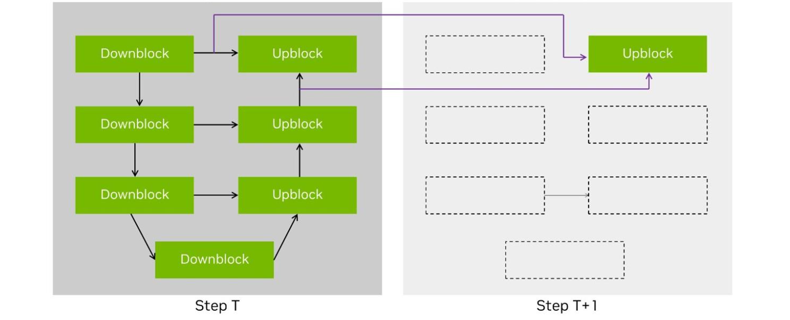
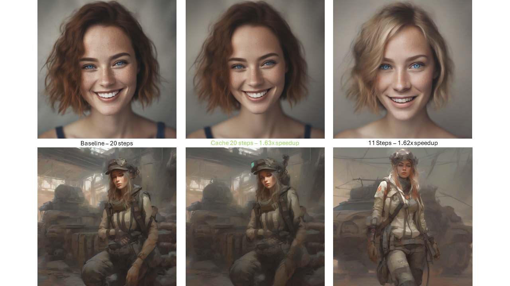

# Cache Diffusion

## Introduction

| Supported Framework | Supported Models |
|----------|----------|
| **PyTorch** | [**PixArt-α**](https://huggingface.co/PixArt-alpha/PixArt-XL-2-1024-MS), [**Stable Diffusion - XL**](https://huggingface.co/stabilityai/stable-diffusion-xl-base-1.0), [**SVD**](https://huggingface.co/stabilityai/stable-video-diffusion-img2vid-xt), [**SD3-Medium**](https://huggingface.co/stabilityai/stable-diffusion-3-medium) |
| **TensorRT** | [**Stable Diffusion - XL**](https://huggingface.co/stabilityai/stable-diffusion-xl-base-1.0), [**SD3-Medium**](https://huggingface.co/stabilityai/stable-diffusion-3-medium) |

Cache Diffusion methods, such as [DeepCache](https://arxiv.org/abs/2312.00858), [Block Caching](https://arxiv.org/abs/2312.03209) and [T-Gate](https://arxiv.org/abs/2404.02747), optimize performance by reusing cached outputs from previous steps instead of recalculating them. This **training-free** caching approach is compatible with a variety of models, like **DiT** and **UNet**, enabling considerable acceleration without compromising quality.

<p align="center">
  
</p>
<p align="center">
  This diagram shows the default SDXL Cache compute graph in this example.
  Significant speedup is achieve through skipping certain blocks at the specific steps.
</p>

## Quick Start

Refer to the provided [example.ipynb](./example.ipynb) for detailed instructions on using cache diffusion.

Using our API, users can create various compute graphs by simply adjusting the parameters. For instance, the default parameter for SDXL is:

```python
SDXL_DEFAULT_CONFIG = [
    {
        "wildcard_or_filter_func": lambda name: "up_blocks.2" not in name,
        "select_cache_step_func": lambda step: (step % 2) != 0,
    }
]

cachify.prepare(pipe, num_inference_steps, SDXL_DEFAULT_CONFIG)
```

Two parameters are essential: `wildcard_or_filter_func` and `select_cache_step_func`.

`wildcard_or_filter_func`: This can be a **str** or a **function**. If the module matches the given str or filter_func, then it will perform the cache operation. For example, if your input is a string `*up_blocks*`, it will match all names containing `up_blocks` and will perform the cache operation in the future, as you use `fnmatch` to match the string. If you use a function instead, the module name will be passed into the function you provided, and if the function returns True, then it will perform the cache operation.

`select_cache_step_func`: During inference, code will check at each step to see if you want to perform the cache operation based on the `select_cache_step_func` you provided. If `select_cache_step_func(current_step)` returns True, the module will cached; otherwise, it won't.

Multiple configurations can be set up, but ensure that the `wildcard_or_filter_func` works correctly. If you input more than one pair of parameters with the same `wildcard_or_filter_func`, the later one in the list will overwrite the previous ones.

### TensorRT support

#### Quick Start

Install [TensorRT](https://developer.nvidia.com/tensorrt) then run:

```bash
python benchmarks.py
```

You can find the latest TensorRT at [here](https://developer.nvidia.com/tensorrt/download).

To execute cache diffusion in TensorRT, follow these steps:

```python
# Load the model

compile(
    pipe.unet,
    onnx_path=Path("./onnx"),
    engine_path=Path("./engine"),
)

cachify.prepare(pipe, num_inference_steps, SDXL_DEFAULT_CONFIG)
```

Afterward, use it as a standard cache diffusion pipeline to generate the image.

Please note that only the UNET component is running in TensorRT, while the other parts remain in PyTorch.

## Demo

The following demo images are generated using `PyTorch==2.3.0 with 1xAda 6000 GPU backend`.

Comparing with naively reducing the generation steps, cache diffusion can achieve the same speedup and also much better image quality, even close to the reference image. If the image quality does not meet your needs or product requirements, you can replace our default configuration with your customized settings.

### Stable Diffusion - XL

<p align="center">
  
</p>
