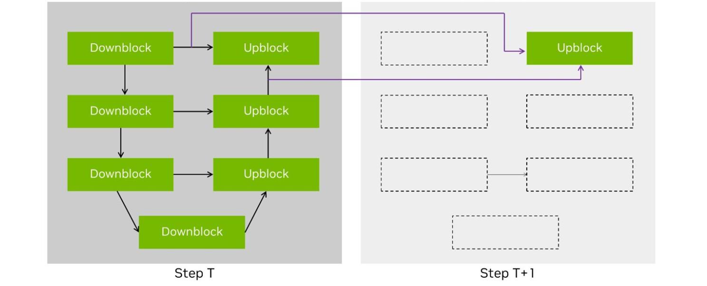

# Diffusers Model Optimizations

Model Optimizer supports techniques like Cache Diffusion and Quantization for Diffusion models, along with scripts to evaluate models using popular evaluation metrics.

Post-training quantization (PTQ) is an effective model optimization technique that compresses your models to lower precision like INT8, FP8, NVFP4, etc. Quantization with Model Optimizer can compress model size by 2x-4x, speeding up inference while preserving model quality. Quantization-Aware Training (QAT) is a powerful technique for optimizing your models, particularly when PTQ methods fail to meet the requirements for your tasks.

Cache Diffusion is a technique that reuses cached outputs from previous diffusion steps instead of recalculating them. This **training-free** caching approach is compatible with a variety of models, like **DiT** and **UNet**, enabling considerable acceleration without compromising quality.

<div align="center">

| **Section** | **Description** | **Link** | **Docs** |
| :------------: | :------------: | :------------: | :------------: |
| Pre-Requisites | Required & optional packages to use this technique | \[[Link](#pre-requisites)\] | |
| Getting Started | Learn how to optimize your models using quantization/cache diffusion to reduce precision and improve inference efficiency | \[[Link](#getting-started)\] | \[[docs](https://nvidia.github.io/TensorRT-Model-Optimizer/guides/1_quantization.html)\] |
| Support Matrix | View the support matrix to see quantization/cahce diffusion compatibility and feature availability across different models | \[[Link](#support-matrix)\] | \[[docs](https://nvidia.github.io/TensorRT-Model-Optimizer/guides/1_quantization.html)\] |
| Cache Diffusion | Caching technique to accelerate inference without compromising quality | \[[Link](#cache-diffusion)\] | |
| Post Training Quantization (PTQ) | Example scripts on how to run PTQ on diffusion models | \[[Link](#post-training-quantization-ptq)\] | \[[docs](https://nvidia.github.io/TensorRT-Model-Optimizer/guides/1_quantization.html)\] |
| Quantization Aware Training (QAT) | Example scripts on how to run QAT on diffusion models | \[[Link](#quantization-aware-training-qat)\] | \[[docs](https://nvidia.github.io/TensorRT-Model-Optimizer/guides/1_quantization.html)\] |
| Quantization Aware Distillation (QAD) | Example scripts on how to run QAD on diffusion models | \[[Link](#quantization-aware-distillation-qad)\] | \[[docs](https://nvidia.github.io/TensorRT-Model-Optimizer/guides/1_quantization.html)\] |
| Build and Run with TensorRT | How to build and run your quantized model with TensorRT | \[[Link](#build-and-run-with-tensorrt-compiler-framework)\] | |
| LoRA | Fuse your LoRA weights prior to quantization | \[[Link](#lora)\] | |
| Evaluate Accuracy | Evaluate your model's accuracy! | \[[Link](#evaluate-accuracy)\] | |
| Pre-Quantized Checkpoints | Ready to deploy Hugging Face pre-quantized checkpoints | \[[Link](#pre-quantized-checkpoints)\] | |
| Resources | Extra links to relevant resources | \[[Link](#resources)\] | |

</div>

## Pre-Requisites

### Docker

Please use the TensorRT docker image (e.g., `nvcr.io/nvidia/tensorrt:25.08-py3`) or visit our [installation docs](https://nvidia.github.io/TensorRT-Model-Optimizer/getting_started/2_installation.html) for more information.

Also follow the installation steps below to upgrade to the latest version of Model Optimizer and install example-specific dependencies.

### Local Installation

Install Model Optimizer with `onnx` and `hf` dependencies using `pip` from [PyPI](https://pypi.org/project/nvidia-modelopt/):

```bash
pip install nvidia-modelopt[onnx,hf]
```

Each subsection (cache_diffusion, quantization, etc.) have their own `requirements.txt` file that needs to be installed separately.

You can find the latest TensorRT [here](https://developer.nvidia.com/tensorrt/download).

Visit our [installation docs](https://nvidia.github.io/TensorRT-Model-Optimizer/getting_started/2_installation.html) for more information.

## Getting Started

### Quantization

With the simple API below, you can very easily use Model Optimizer to quantize your model. Model Optimizer achieves this by converting the precision of your model to the desired precision, and then using a small dataset (typically 128-512 samples) to [calibrate](https://nvidia.github.io/TensorRT-Model-Optimizer/guides/_basic_quantization.html) the quantization scaling factors.

```python
import modelopt.torch.quantization as mtq

def forward_pass(model):
    for prompt in prompts:
        _ = model(prompt)

mtq.quantize(model=transformer, config=quant_config, forward_func=forward_pass)
```

## Support Matrix

### TensorRT Compiler Framework

| Model | fp8 | int8_sq | int4_awq | w4a8_awq<sup>1</sup> | nvfp4<sup>2</sup> | nvfp4_svdquant<sup>3</sup> | Cache Diffusion |
| :---: | :---: | :---: | :---: | :---: | :---: | :---: | :---: |
| [FLUX](https://huggingface.co/black-forest-labs/FLUX.1-dev) | ✅ | ✅ | ✅ | ✅ | ✅ | ✅ | - |
| [Stable Diffusion 3](https://huggingface.co/stabilityai/stable-diffusion-3-medium) | ✅ | ✅ | ✅ | ✅ | ✅ | ✅ | ✅ |
| [Stable Diffusion XL](https://huggingface.co/papers/2307.01952) | ✅ | ✅ | ✅ | ✅ | ✅ | ✅ | ✅ |
| [SDXL-Turbo](https://huggingface.co/stabilityai/sdxl-turbo) | ✅ | ✅ | ✅ | ✅ | ✅ | ✅ | - |
| [Stable Diffusion 2.1](https://huggingface.co/stabilityai/stable-diffusion-2-1) | ✅ | ✅ | ✅ | ✅ | ✅ | ✅ | - |

> *<sup>1.</sup>The w4a8_awq is an experimental quantization scheme that may result in a higher accuracy penalty.*

> *<sup>2.</sup>A selective set of the popular models are internally tested. The actual model support list may be longer. NVFP4 inference requires Blackwell GPUs and TensorRT-LLM v0.17 or later*

> *<sup>3.</sup>The SVDQuant Perf in TRT might not good as the [Nunchaku: MIT-Nvidia](https://github.com/nunchaku-tech/nunchaku) at this moment.*

## Post Training Quantization (PTQ)

We support calibration for INT8, FP8 and FP4 precision and for both weights and activations. The examples below shows how to use Model Optimizer to calibrate and quantize the backbone section of diffusion models. The backbone section typically consumes >95% of the E2E diffusion latency.

We also provide instructions on deploying and running E2E diffusion pipelines with Model Optimizer quantized INT8 and FP8 Backbone to generate images and measure latency on target GPUs. Note, Jetson devices are not supported at this time due to the incompatibility of the software.

> [!NOTE]
> Model calibration requires relatively more GPU computing power then deployment.It does not need to be on the same GPUs as the deployment target GPUs. Using the command line below will execute both calibration and ONNX export.

### Quantize and export scripts

#### 8-bit Quantize and ONNX Export [Script](./quantization/build_sdxl_8bit_engine.sh)

You can run the following script to quantize SDXL backbone to INT8 or FP8 and generate an onnx model built with default settings for SDXL. You can then directly head to the [Build the TRT engine for the Quantized ONNX Backbone](#build-the-trt-engine-for-the-quantized-onnx-backbone) section to run E2E pipeline and generate images.

```sh
bash build_sdxl_8bit_engine.sh --format {FORMAT} # FORMAT can be int8 or fp8
```

If you prefer to customize parameters in calibration or run other models, please follow the instructions below.

#### FLUX-Dev|SD3-Medium|SDXL|SDXL-Turbo INT8 [Script](./quantization/quantize.py)

```sh
python quantize.py \
    --model {flux-dev|sdxl-1.0|sdxl-turbo|sd3-medium} \
    --format int8 --batch-size 2 \
    --calib-size 32 --alpha 0.8 --n-steps 20 \
    --model-dtype {Half/BFloat16} --trt-high-precision-dtype {Half|BFloat16} \
    --quantized-torch-ckpt-save-path ./{MODEL_NAME}.pt --onnx-dir {ONNX_DIR}
```

#### FLUX-Dev|SDXL|SDXL-Turbo|LTX-Video FP8/FP4 [Script](./quantization/quantize.py)

*In our example code, FP4 is only supported for Flux. However, you can modify our script to enable FP4 format support for your own model.*

```sh
python quantize.py \
    --model {flux-dev|sdxl-1.0|sdxl-turbo|ltx-video-dev} --model-dtype {Half|BFloat16} --trt-high-precision-dtype {Half|BFloat16} \
    --format {fp8|fp4} --batch-size 2 --calib-size {128|256} --quantize-mha \
    --n-steps 20 --quantized-torch-ckpt-save-path ./{MODEL_NAME}.pt --collect-method default \
    --onnx-dir {ONNX_DIR}
```

We recommend using a device with a minimum of 48GB of combined CPU and GPU memory for exporting ONNX models. If not, please use CPU for onnx export.

#### Important Parameters

- `percentile`: Control quantization scaling factors (amax) collecting range, meaning that we will collect the chosen amax in the range of `(n_steps * percentile)` steps. Recommendation: 1.0
- `alpha`: A parameter in SmoothQuant, used for linear layers only. Recommendation: 0.8 for SDXL
- `calib-size`: For SDXL INT8, we recommend 32 or 64, for SDXL FP8, 128 is recommended.
- `n_steps`: Recommendation: SD/SDXL 20 or 30, SDXL-Turbo 4.

**Then, we can load the generated checkpoint and export the INT8/FP8 quantized model in the next step. For FP8, we only support the TRT deployment on Ada/Hopper GPUs.**

## Quantization Aware Training (QAT)

Quantization-Aware Training (QAT) is a powerful technique for optimizing your models, particularly when post-training quantization (PTQ) methods fail to meet the requirements for your tasks. By simulating the effects of quantization during training, QAT allows the model to learn to minimize the quantization error, ultimately delivering better accuracy.

While the example below uses Hugging Face Accelerate for simplicity. You can integrate QAT into your workflow using your preferred training setup.

### How QAT Works in ModelOPT

With ModelOPT, the forward pass simulates quantization, allowing the model to adjust its weights to minimize training loss and reduce quantization errors. This enables the model to better handle the constraints of quantized hardware without significant loss of performance.

```python
import modelopt.torch.opt as mto

# Restore the model in its quantized state using ModelOPT's API
mto.restore(transformer_model, args.restore_quantized_ckpt)

# Move the model to the appropriate device and set the desired weight precision
transformer_model.to(accelerator.device, dtype=weight_dtype)
transformer_model.requires_grad_(True)

transformer_model, optimizer, train_dataloader, lr_scheduler = accelerator.prepare(
    transformer_model, optimizer, train_dataloader, lr_scheduler
)

```

Once the model is loaded in its quantized state through ModelOPT, you can proceed with regular training. The QAT process will automatically take place during the forward passes.

## Quantization Aware Distillation (QAD)

Distillation is a powerful approach where a high-precision model (the teacher) guides the training of a quantized model (the student). ModelOPT simplifies the process of combining distillation with QAT by handling most of the complexity for you.

For more details about distillation, please refer to this [link](https://nvidia.github.io/TensorRT-Model-Optimizer/guides/4_distillation.html).

```diff
import modelopt.torch.opt as mto
import modelopt.torch.distill as mtd

# Restore the model in its quantized state using ModelOPT's API
mto.restore(transformer, args.restore_quantized_ckpt)

'''
After mtd.convert, the model structure becomes:

model:
    transformer_0
    transformer_1
    teacher_model:
        transformer_0
        transformer_1

And the forward pass is automatically monkey-patched to:

def forward(input):
    student_output = model(input)
    _ = teacher_model(input)
    return student_output
'''

+ # Configuration for knowledge distillation (KD)
+ kd_config = {
+     "teacher_model": teacher_model,
+     "criterion": distill_config["criterion"],
+     "loss_balancer": distill_config["loss_balancer"],
+     "expose_minimal_state_dict": False,
+ }
+ transformer = mtd.convert(transformer, mode=[("kd_loss", kd_config)])

# Move the model to the appropriate device and set the desired weight precision
transformer.to(accelerator.device, dtype=weight_dtype)
transformer.requires_grad_(True)

# Making sure to freeze the weights from model._teacher_model
transformer, optimizer, train_dataloader, lr_scheduler = accelerator.prepare(
    transformer, optimizer, train_dataloader, lr_scheduler
)

# Compute the distillation loss using ModelOPT's compute_kd_loss
+ ...
+ loss = transformer.compute_kd_loss(...)
+ ...

```

## Build and Run with TensorRT Compiler Framework

### Build the TRT engine for the Quantized ONNX Backbone

> [!IMPORTANT]
> TensorRT environment must be setup prior -- Please see [Pre-Requisites](#pre-requisites)
> INT8 requires **TensorRT version >= 9.2.0**. If you prefer to use the FP8 TensorRT, ensure you have **TensorRT version 10.2.0 or higher**. You can download the latest version of TensorRT at [here](https://developer.nvidia.com/tensorrt/download). Deployment of SVDQuant is currently not supported.

Generate INT8/FP8 Backbone Engine

```bash
# For SDXL
trtexec --builderOptimizationLevel=4 --stronglyTyped --onnx=./model.onnx \
    --minShapes=sample:2x4x128x128,timestep:1,encoder_hidden_states:2x77x2048,text_embeds:2x1280,time_ids:2x6 \
    --optShapes=sample:16x4x128x128,timestep:1,encoder_hidden_states:16x77x2048,text_embeds:16x1280,time_ids:16x6 \
    --maxShapes=sample:16x4x128x128,timestep:1,encoder_hidden_states:16x77x2048,text_embeds:16x1280,time_ids:16x6 \
    --saveEngine=model.plan

# For SD3-Medium
trtexec --builderOptimizationLevel=4 --stronglyTyped --onnx=./model.onnx \
    --minShapes=hidden_states:2x16x128x128,timestep:2,encoder_hidden_states:2x333x4096,pooled_projections:2x2048 \
    --optShapes=hidden_states:16x16x128x128,timestep:16,encoder_hidden_states:16x333x4096,pooled_projections:16x2048 \
    --maxShapes=hidden_states:16x16x128x128,timestep:16,encoder_hidden_states:16x333x4096,pooled_projections:16x2048 \
    --saveEngine=model.plan

# For FLUX-Dev FP8
trtexec --onnx=./model.onnx --fp8 --bf16 --stronglyTyped \
    --minShapes=hidden_states:1x4096x64,img_ids:4096x3,encoder_hidden_states:1x512x4096,txt_ids:512x3,timestep:1,pooled_projections:1x768,guidance:1 \
    --optShapes=hidden_states:1x4096x64,img_ids:4096x3,encoder_hidden_states:1x512x4096,txt_ids:512x3,timestep:1,pooled_projections:1x768,guidance:1 \
    --maxShapes=hidden_states:1x4096x64,img_ids:4096x3,encoder_hidden_states:1x512x4096,txt_ids:512x3,timestep:1,pooled_projections:1x768,guidance:1 \
    --saveEngine=model.plan
```

**Please note that `maxShapes` represents the maximum shape of the given tensor. If you want to use a larger batch size or any other dimensions, feel free to adjust the value accordingly.**

### Run End-to-end Stable Diffusion Pipeline with Model Optimizer Quantized ONNX Model and demoDiffusion

#### demoDiffusion

If you want to run end-to-end SD/SDXL pipeline with Model Optimizer quantized UNet to generate images and measure latency on target GPUs, here are the steps:

- Clone a copy of [demo/Diffusion repo](https://github.com/NVIDIA/TensorRT/tree/release/10.2/demo/Diffusion).

- Following the README from demoDiffusion to set up the pipeline, and run a baseline txt2img example (fp16):

```sh
# SDXL
python demo_txt2img_xl.py "enchanted winter forest, soft diffuse light on a snow-filled day, serene nature scene, the forest is illuminated by the snow" --negative-prompt "normal quality, low quality, worst quality, low res, blurry, nsfw, nude" --version xl-1.0 --scheduler Euler --denoising-steps 30 --seed 2946901
# Please refer to the examples provided in the demoDiffusion SD/SDXL pipeline.
```

Note, it will take some time to build TRT engines for the first time

- Replace the fp16 backbone TRT engine with int8 engine generated in [Build the TRT engine for the Quantized ONNX Backbone](#build-the-trt-engine-for-the-quantized-onnx-backbone), e.g.,:

```sh
cp -r {YOUR_UNETXL}.plan ./engine/
```

Note, the engines must be built on the same GPU, and ensure that the INT8 engine name matches the names of the FP16 engines to enable compatibility with the demoDiffusion pipeline.

- Run the above txt2img example command again. You can compare the generated images and latency for fp16 vs int8.
  Similarly, you could run end-to-end pipeline with Model Optimizer quantized backbone and corresponding examples in demoDiffusion with other diffusion models.

### Running the inference pipeline with DeviceModel

DeviceModel is an interface designed to run TensorRT engines like torch models. It takes torch inputs and returns torch outputs. Under the hood, DeviceModel exports a torch checkpoint to ONNX and then generates a TensorRT engine from it. This allows you to swap the backbone of the diffusion pipeline with DeviceModel and execute the pipeline for your desired prompt.

Generate a quantized torch checkpoint using the [Script](./quantization/quantize.py) shown below:

```bash
python quantize.py \
    --model {sdxl-1.0|sdxl-turbo|sd3-medium|flux-dev} \
    --format fp8 \
    --batch-size {1|2} \
    --calib-size 128 \
    --n-steps 20 \
    --quantized-torch-ckpt-save-path ./{MODEL}_fp8.pt \
    --collect-method default
```

Generate images for the quantized checkpoint with the following [Script](./quantization/diffusion_trt.py):

```bash
python diffusion_trt.py \
    --model {sdxl-1.0|sdxl-turbo|sd3-medium|flux-dev} \
    --prompt "A cat holding a sign that says hello world" \
    [--restore-from ./{MODEL}_fp8.pt] \
    [--onnx-load-path {ONNX_DIR}] \
    [--trt-engine-load-path {ENGINE_DIR}] \
    [--dq_only] \
    [--torch]
```

This script will save the output image as `./{MODEL}.png` and report the latency of the TensorRT backbone.
To generate the image with FP16|BF16 precision, you can run the command shown above without the `--restore-from` argument.

While loading a TensorRT engine using the --trt-engine-load-path argument, it is recommended to load only engines generated using this pipeline.

#### Demo Images

| SDXL FP16 | SDXL INT8 |
|:---------:|:---------:|
|  |  |

### LoRA

For optimal performance of INT8/FP8 quantized models, we highly recommend fusing the LoRA weights prior to quantization. Failing to do so can disrupt TensorRT kernel fusion when integrating the LoRA layer with INT8/FP8 Quantize-Dequantize (QDQ) nodes, potentially leading to performance losses.

Detailed guidance on how to fuse LoRA weights can be found in the Hugging Face [PEFT documentation](https://github.com/huggingface/peft):

After fusing the weights, proceed with the calibration and you can follow our code to do the quantization.

```python
pipe = DiffusionPipeline.from_pretrained(
    "stabilityai/stable-diffusion-xl-base-1.0",
    torch_dtype=torch.float16,
    variant="fp16",
    use_safetensors=True,
).to("cuda")
pipe.load_lora_weights(
    "CiroN2022/toy-face", weight_name="toy_face_sdxl.safetensors", adapter_name="toy"
)
pipe.fuse_lora(lora_scale=0.9)
...
# All the LoRA layers should be fused
check_lora(pipe.unet)

mtq.quantize(pipe.unet, quant_config, forward_loop)
mto.save(pipe.unet, ...)
```

When it's time to export the model to ONNX format, ensure that you load the PEFT-modified LoRA model first.

```python
pipe = DiffusionPipeline.from_pretrained(
    "stabilityai/stable-diffusion-xl-base-1.0",
    torch_dtype=torch.float16,
    variant="fp16",
    use_safetensors=True,
)
pipe.load_lora_weights(
    "CiroN2022/toy-face", weight_name="toy_face_sdxl.safetensors", adapter_name="toy"
)
pipe.fuse_lora(lora_scale=0.9)
mto.restore(pipe.unet, your_quantized_ckpt)
...
# Export the onnx model
```

By following these steps, your PEFT LoRA model should be efficiently quantized using ModelOpt, ready for deployment while maximizing performance.

## Cache Diffusion

Cache Diffusion methods, such as [DeepCache](https://arxiv.org/abs/2312.00858), [Block Caching](https://arxiv.org/abs/2312.03209) and [T-Gate](https://arxiv.org/abs/2404.02747), optimize performance by reusing cached outputs from previous steps instead of recalculating them. This **training-free** caching approach is compatible with a variety of models, like **DiT** and **UNet**, enabling considerable acceleration without compromising quality.

<div align="center">
  
  This diagram shows the default SDXL Cache compute graph in this example.
  Significant speedup is achieve through skipping certain blocks at the specific steps.
</div>

### Getting Started

With the simple API below, you can very easily use Model Optimizer to apply cache diffusion to your model. Model Optimizer achieves this by breaking down different blocks into a single TensorRT engine, and at inference time, we combine multiple TensorRT engines in the same way a PyTorch module would..

```python
import torch
from cache_diffusion import cachify
from cache_diffusion.utils import SDXL_DEFAULT_CONFIG
from diffusers import DiffusionPipeline

pipe = DiffusionPipeline.from_pretrained(
    "stabilityai/stable-diffusion-xl-base-1.0",
    torch_dtype=torch.float16,
    variant="fp16",
    use_safetensors=True,
)
pipe = pipe.to("cuda")

num_inference_steps = 20
prompt = "beautiful lady, (freckles), big smile, blue eyes, short hair, dark makeup, hyperdetailed photography, soft light, head and shoulders portrait, cover"

cachify.prepare(pipe, SDXL_DEFAULT_CONFIG)
cachify.enable(pipe)

generator = torch.Generator(device="cuda").manual_seed(2946901)

with cachify.infer(pipe) as cached_pipe:
    img = cached_pipe(
        prompt=prompt, num_inference_steps=num_inference_steps, generator=generator
    ).images[0]

img
```

### PyTorch Framework

Please refer to [example.ipynb](./cache_diffusion/example.ipynb) for more details on how to apply cache diffusion.

### TensorRT Compiler Framework

To execute cache diffusion in TensorRT, follow these steps:

```python
# Load the model

compile(
    pipe.unet,
    model_id="sdxl",
    onnx_path=Path("./onnx"),
    engine_path=Path("./engine"),
)

cachify.prepare(pipe, num_inference_steps, SDXL_DEFAULT_CONFIG)
```

Afterward, use it as a standard cache diffusion pipeline to generate the image.

Please note that only the UNET component is running in TensorRT, while the other parts remain in PyTorch.

### Customize

Model Optimizer also provides an API to create various compute graphs by simply adjusting the parameters. For instance, the default parameter for SDXL is:

```python
SDXL_DEFAULT_CONFIG = [
    {
        "wildcard_or_filter_func": lambda name: "up_blocks.2" not in name,
        "select_cache_step_func": lambda step: (step % 2) != 0,
    }
]

cachify.prepare(pipe, num_inference_steps, SDXL_DEFAULT_CONFIG)
```

Two parameters are essential: `wildcard_or_filter_func` and `select_cache_step_func`.

`wildcard_or_filter_func`: This can be a **str** or a **function**. If the module matches the given str or filter_func, then it will perform the cache operation. For example, if your input is a string `*up_blocks*`, it will match all names containing `up_blocks` and will perform the cache operation in the future, as you use `fnmatch` to match the string. If you use a function instead, the module name will be passed into the function you provided, and if the function returns True, then it will perform the cache operation.

`select_cache_step_func`: During inference, code will check at each step to see if you want to perform the cache operation based on the `select_cache_step_func` you provided. If `select_cache_step_func(current_step)` returns True, the module will cached; otherwise, it won't.

Multiple configurations can be set up, but ensure that the `wildcard_or_filter_func` works correctly. If you input more than one pair of parameters with the same `wildcard_or_filter_func`, the later one in the list will overwrite the previous ones.

### Demo

The following demo images are generated using `torch==2.3.0` with a single RTX 6000 Ada GPU.

Comparing with naively reducing the generation steps, cache diffusion can achieve the same speedup and also much better image quality, even close to the reference image. If the image quality does not meet your needs or product requirements, you can replace our default configuration with your customized settings.

#### Stable Diffusion - XL


### Notes About Randomness

Stable Diffusion pipelines rely heavily on random sampling operations, which include creating Gaussian noise tensors to denoise and adding noise in the scheduling step. In the quantization recipe, we don't fix the random seed. As a result, every time you run the calibration pipeline, you could get different quantizer amax values. This may lead to the generated images being different from the ones generated with the original model. We suggest to run a few more times and choose the best one.

## Evaluate Accuracy

This simple code demonstrates how to evaluate images generated by diffusion (or other generative) models using popular metrics such as [imagereward](https://arxiv.org/abs/2304.05977), [clip-iqa](https://arxiv.org/abs/2207.12396), and [clip](https://arxiv.org/abs/2104.08718).

### Install Requirements

```bash
pip install -r eval/requirments.txt
```

### Data Format

Prepare a JSON file with your prompts and corresponding images in the structure below:

```json
[
    {
        "prompt": "YOUR_PROMPT",
        "images": {
            "MODEL_NAME": "PATH_TO_THE_IMAGE",
            "MODEL_NAME": "PATH_TO_THE_IMAGE",
            ...
        }
    },
    ...
]
```

- `prompt`: The text prompt used to generate the images.
- `images`: Key-value pairs of model names and image file paths.

### Evaluate

Run the evaluation script with your JSON file:

```bash
python eval/main.py --data-path {PATH_TO_THE_IMAGE_JSON_PATH} --metrics imagereward
```

- `--data-path`: Path to your JSON file.
- `--metrics`: One or more metrics to compute (e.g. imagereward, clip-iqa, clip).

### Sample results

Example metrics obtained with 30 sampling steps on a set of 1K prompts (values will vary based on data and model configurations):

| Model | Precision | ImageReward | CLIP-IQA | CLIP |
|:------------:|:------------:|:------------:|:------------:|:------------:|
| FLUX 1 Dev | BF16 | 1.118 | 0.927 | 30.15 |
| | FP4 PTQ | 1.096 | 0.923 | 29.86 |
| | FP4 QAT | 1.119 | 0.928 | 29.919 |

## Pre-Quantized Checkpoints

- Ready-to-deploy checkpoints \[[🤗 Hugging Face - Black Forest Labs](https://huggingface.co/black-forest-labs)\]
- Deployable on [TensorRT](https://developer.nvidia.com/tensorrt) and [PyTorch](https://github.com/pytorch/pytorch)
- More models coming soon!

## Resources

- 📅 [Roadmap](https://github.com/NVIDIA/TensorRT-Model-Optimizer/issues/146)
- 📖 [Documentation](https://nvidia.github.io/TensorRT-Model-Optimizer)
- 🎯 [Benchmarks](../benchmark.md)
- 💡 [Release Notes](https://nvidia.github.io/TensorRT-Model-Optimizer/reference/0_changelog.html)
- 🐛 [File a bug](https://github.com/NVIDIA/TensorRT-Model-Optimizer/issues/new?template=1_bug_report.md)
- ✨ [File a Feature Request](https://github.com/NVIDIA/TensorRT-Model-Optimizer/issues/new?template=2_feature_request.md)
