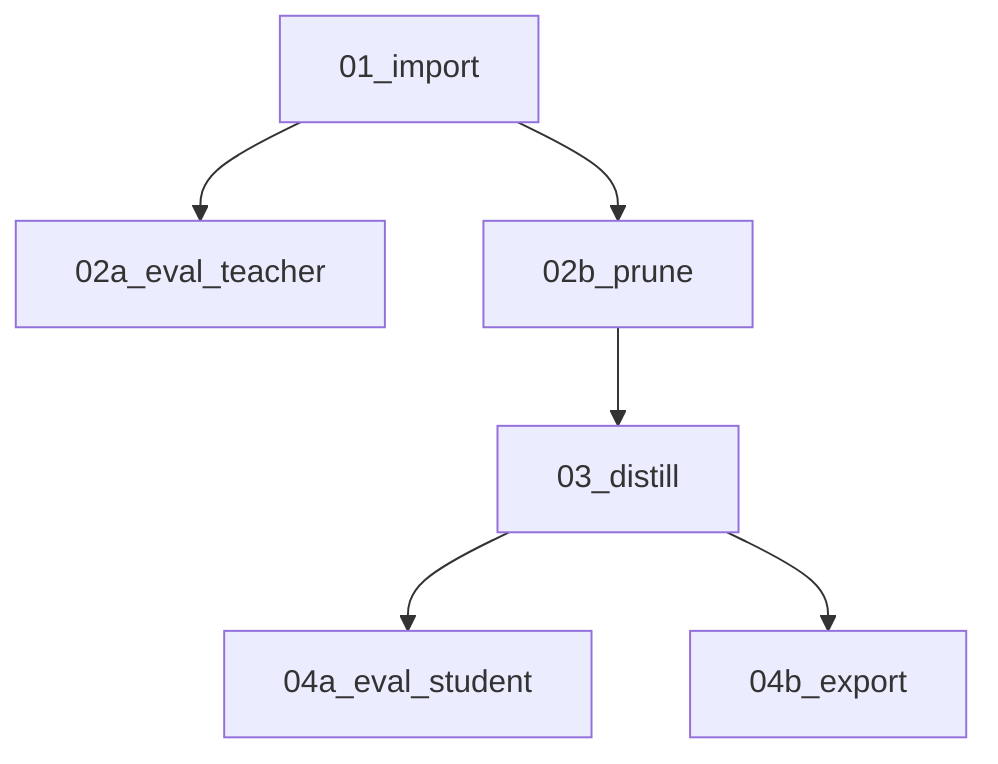

<div align="center">

# NeMo Pruning + Knowledge Distillation Simplified Flow Example

</div>

## Overview

This directory contains an end-to-end Pruning + Knowledge Distillation Simplified Flow example using NeMo for model compression. It supports structured pruning followed by knowledge distillation to recover performance after compression.

After structured pruning, the compressed model may show some accuracy degradation; the knowledge distillation stage aims to recover that loss by transferring knowledge from the full-precision teacher model to the pruned student model.

## Flow Stages

The Simplified Flow runs the following steps:

1. 01_import — Import HuggingFace model to NeMo format
1. 02a_eval_teacher — Evaluate teacher model on 5% of MMLU benchmark
1. 02b_prune — Apply structured pruning to create a compressed student model
1. 03_distill — Knowledge distillation from teacher to pruned student model
1. 04a_eval_student — Evaluate student model on 5% of MMLU benchmark
1. 04b_export — Export final compressed model to HuggingFace format



## Results

Pruning + Knowledge Distillation of Qwen3-8B achieves significant model compression while recovering most of the accuracy through distillation. We depth-prune the model from 32 to 24 layers (reducing from 8B to 6B parameters) and distill for ~28,000 steps (determined by sequence length, default 4096) with a learning rate of 1e-4 and global batch size of 768 using a 25% subset of the [ClimbMix dataset](https://huggingface.co/datasets/OptimalScale/ClimbMix). (This is about 90 billion tokens and takes a total of ~6k H100 GPU hours)

|                                   | Tokens per Second * | MMLU |
|-----------------------------------|---------------------|------|
| Qwen3-8B Original                 | 4420                | 74.9 |
| Qwen3-6B Pruned+Distilled from 8B | 6950                | 72.5 |
| Qwen3-4B Original (comparison)    | 5210                | 70.0 |

The resulting compressed student maintains competitive performance while being significantly faster with fewer parameters than the teacher. It also happens to have both better performance and throughput than the existing Qwen3-4B model!

\* _Measured on H100 using TRT-LLM, FP8 precision_

## Usage

### Prerequisites

You can run the example either locally or on a [Slurm cluster](ADVANCED.md).

To run the example locally, launch a [NeMo container](https://catalog.ngc.nvidia.com/orgs/nvidia/containers/nemo) with version 25.09 or higher. Clone the `TensorRT-Model-Optimizer` repository and `NeMo` repository (checkout a specific commit for NeMo), then mount it onto your docker container.

- `git clone https://github.com/NVIDIA/TensorRT-Model-Optimizer.git`

Example docker command:

```bash
docker run -v /home/user/:/home/user/ -v /home/user/NeMo:/opt/NeMo -v /home/user/TensorRT-Model-Optimizer:/opt/TensorRT-Model-Optimizer --gpus all -it --shm-size 20g --rm nvcr.io/nvidia/nemo:25.09 bash
```

You will also need to set your Huggingface token with `export HF_TOKEN=<your-token>`. You may also need to enable write access to the docker container to the `examples/nemo_run` folder by doing `chmod 777 nemo_run` so that logs can be written.

### Dataset Preparation

Unlike the QAT flow, this workflow does not automatically download the dataset due to its large size and long tokenization time.
You must first prepare the dataset by running:

```bash
python ../common/process_climbmix.py --output-dir /path/to/save
```

This will download and process the ClimbMix dataset, creating the necessary data files for training.

### Running the Flow via Slurm

After launching the NeMo container with the specified mounts, change the contents of the `SLURM_CONFIG` in `nemo_prune_kd_flow.py`
to reflect your environment, and then perform the following:

Launch the example with the `nemo_prune_kd_flow.py` script. To use a different model than the default model (Qwen3-8B), you can add the `--model-name <hf-model-name> --base-recipe <recipe-name>` flags and use the model's HuggingFace name and NeMo recipe names listed [here](https://github.com/NVIDIA/NeMo/tree/main/nemo/collections/llm/recipes). Provide the processed dataset path using the `--data-dir` flag.

To perform Pruning + Knowledge Distillation, run:

```bash
python prune_distill/nemo_prune_kd_flow.py --log-dir /my/log/dir --data-dir /path/to/climbmix_proc --use-slurm
```

> **_NOTE:_** You can omit the `--use-slurm` flag to run locally for testing, and optionally with `--mock-run` to use a mock dataset.

## Supported models

Locally this script currently supports models that can be trained on 1 node with 8 x 80GB GPUs. On Slurm you can configure the number of nodes/gpus for training and pruning with the following flags: `--nodes`, `--train-gpus`.

The default configuration works on 1 node with 8 H100 GPUs:

- **Model**: Qwen/Qwen3-8B
- **Recipe**: qwen3_8b

### Dataset limitations

The current pruning + knowledge distillation recipe has been tuned for the Qwen3-8B model to achieve significant speedup while maintaining performance. Pruning and distillation results are highly dependent on the specific model, dataset, and hyperparameters. There is no guarantee that a given dataset will recover the accuracy of the pruned model. Feel free to try your own model and dataset combinations and test which combination works best.
