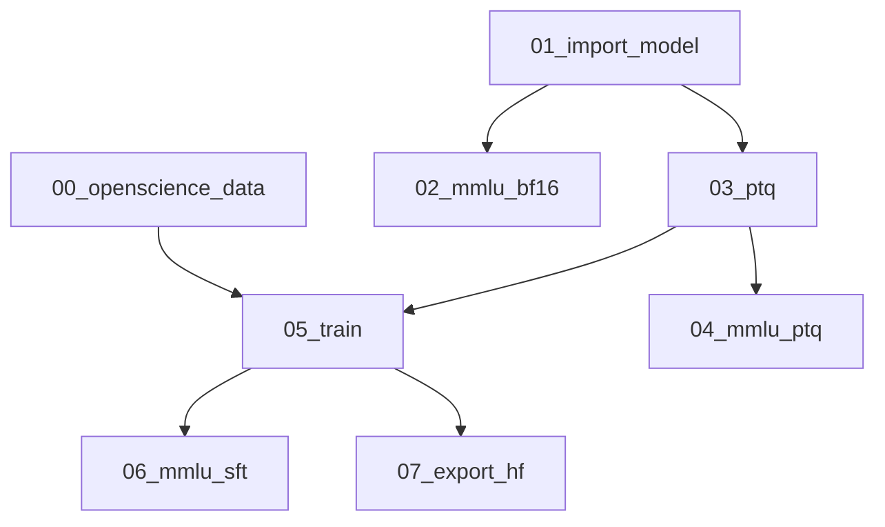

<div align="center">

# NeMo QAT/QAD Simplified Flow Example

[Slurm Examples](ADVANCED.md) |
[Advanced Topics](ADVANCED.md) |
[NeMo Integration](https://github.com/NVIDIA-NeMo/NeMo/tree/main/nemo/collections/llm/modelopt)

</div>

## Overview

This directory contains an end-to-end QAT Simplified Flow example using NeMo for model training. It supports both QAT with cross-entropy loss and QAD (quantization-aware distillation) with knowledge-distillation loss between the BF16 teacher and quantized student models.

After PTQ (post-training quantization), the quantized model may show some accuracy degradation on tasks like MMLU; the QAT/QAD stages aim to recover that loss.

## Flow Stages

The Simplified Flow runs the following steps in order:

1. 00_openscience_data — Process NVIDIA/OpenScience data (skipped if `--data-path` is given)
1. 01_import_model — Import NeMo BF16 model checkpoint
1. 02_mmlu_bf16 — Evaluate 5% MMLU on BF16 checkpoint
1. 03_ptq — Apply PTQ
1. 04_mmlu_ptq — Evaluate 5% MMLU on PTQ checkpoint
1. 05_train — SFT/QAT (and optional QAD)
1. 06_mmlu_sft — Evaluate 5% MMLU on SFT/QAT checkpoint
1. 07_export_hf — Export to Hugging Face (Unified) format



## Results

QAT of Qwen3-8B NVFP4 recovers most of the accuracy on the MMLU benchmark after NVFP4 PTQ. We finetune the Qwen3-8B NVFP4 checkpoint for 200 steps with a learning rate of 1e-5 and global batch size of 512 on one node of 8 x H100 GPUs.

|                           | MMLU 5% |
|---------------------------|---------|
| Qwen3-8B FP16             | 73.8    |
| Qwen3-8B NVFP4            | 70.3    |
| Qwen3-8B NVFP4 after QAT  | 72.8    |

The resulting exported checkpoint also is much smaller in memory at 6.4GB compared to the original BF16 checkpoint which is 16.4 GB.

## Usage

### Prerequisites

You can run the example either locally  or on a [Slurm cluster](ADVANCED.md).

To run the example locally, launch a [NeMo container](https://catalog.ngc.nvidia.com/orgs/nvidia/containers/nemo) with version 25.07 or higher. Clone the `TensorRT-Model-Optimizer` repository and `NeMo` repository (checkout a specific commit for NeMo), then mount it onto your docker container.

- `git clone https://github.com/NVIDIA/TensorRT-Model-Optimizer.git`
- `git clone https://github.com/NVIDIA-NeMo/NeMo.git && cd NeMo && git checkout 676ed1a`

Example docker command:

```bash
docker run -v  /home/user/:/home/user/ -v /home/user/NeMo:/opt/NeMo -v /home/user/TensorRT-Model-Optimizer/modelopt/:/usr/local/lib/python3.12/dist-packages/modelopt --gpus all -it --shm-size 20g --rm nvcr.io/nvidia/nemo:25.07 bash
```

You will also need to set your Huggingface token with `export HF_TOKEN=<your-token>`. You may also need to enable write access to the docker container to the `examples/nemo_run` folder by doing `chmod 777 nemo_run` so that logs can be written.

### Running the Flow Locally

After launching the NeMo container with the specified mounts, follow these examples to run the flow locally.

#### QAT

From the `nemo_run` folder, launch the example with the `qat/nemo_qat_flow.py` script. To use a different model than the default model (Qwen3-8B), you can add the `--model-name <hf-model-name> --finetune-recipe <recipe-name>` flags and use the model's HuggingFace name and NeMo recipe names listed [here](https://github.com/NVIDIA/NeMo/tree/main/nemo/collections/llm/recipes). To provide your own custom dataset, use the `--data-path` flag, otherwise the default [NVIDIA OpenScience](https://huggingface.co/datasets/nvidia/OpenScience) dataset will be used.

To perform QAT, run:

```bash
python qat/nemo_qat_flow.py  --log-dir /my/log/dir --experiment qat_experiment
```

> **_NOTE:_** To enable KV cache quantization, add `--enable-kv-cache` and specify qformat using `--kv-cache-qformat <fp8, nvfp4>`.

#### QAD

In order to train using QAD, launch the example with `python qat/nemo_qat_flow.py --model-name <hf-model-name> --distill`. It will utilize `distillation_recipe` with quantized student model and full precision teacher model to train the quantized model.

To perform QAD training, run:

```bash
python qat/nemo_qat_flow.py --distill --log-dir /my/log/dir --experiment qad_experiment
```

## Supported models

Locally this script currently supports models that can be trained on 1 node with 8 x 80GB GPUs. On Slurm you can configure the number of nodes/gpus for training and PTQ with the following flags: `--train-nodes`, `--train-gpus`, `--ptq-gpus`.

The default configuration works on 1 node with 4 H100 GPUs for PTQ and 8 H100 GPUs for training with the following model:

- **Model**: Qwen3-8B
- **Recipe**: qwen3_8b

### Common Errors

Depending on the amount of memory your GPUs have, you may get an Out of Memory error. If that happens, add flags for `--tensor_parallelism` or `--pipeline_parallelism` (e.g. `--tensor_parallelism 2`).

### Custom Chat Template

By default the script will use the model/tokenizer's chat template, which may not contain the `` and `` tags around the assistant tokens which are needed to generate the assistant loss mask (see [this PR](https://github.com/huggingface/transformers/pull/30650)). To provide path to a custom chat template, use the `--chat-template <my_template.txt>` flag.

### Dataset limitations

The current QAT recipe has been tuned for the Qwen3-8B model to improve accuracy on the MMLU benchmark after PTQ degradation. QAT/QAD results are highly dependent on the specific model, dataset, and hyperparameters. There is no guarantee that the same dataset will recover the accuracy of the PTQ model. Feel free to try your own model and dataset combinations and test which combination works best.
