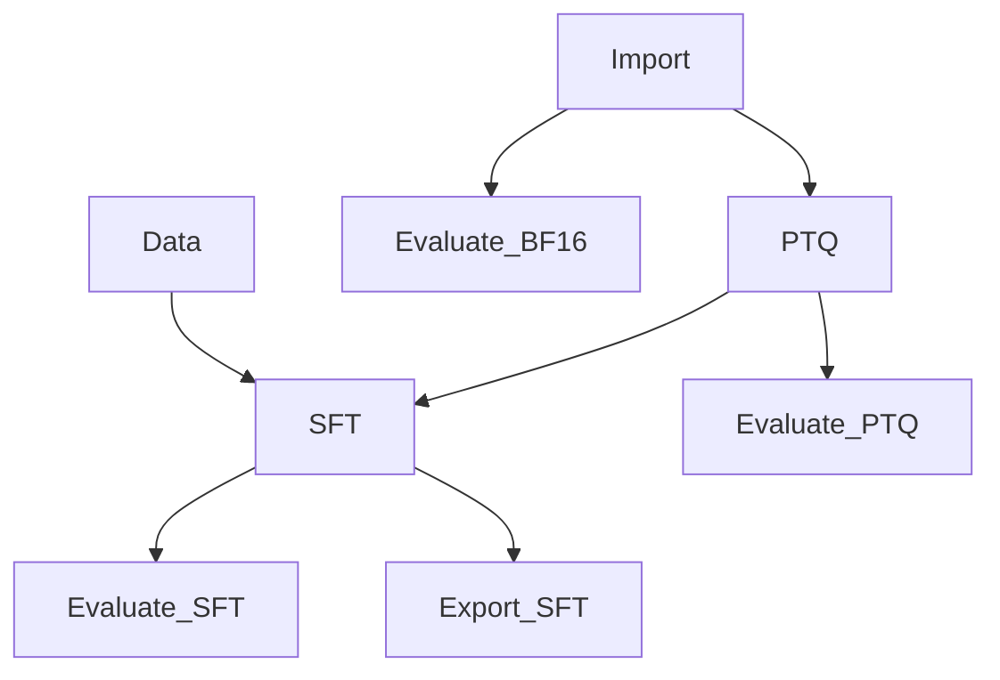

# NeMo QAT/QAD Simplified Flow Example

## Overview

This directory contains an end-to-end QAT Simplified Flow example using NeMo for model training. It supports both QAT with cross-entropy loss and QAD (quantization-aware distillation) with knowledge-distillation loss between the BF16 teacher and quantized student models.

## Flow Stages

Currently the Simplified Flow runs the following steps in order:

1. Process Nvidia/OpenScience data (if `--data-path` is not specified)
1. Import NeMo BF16 model checkpoint and evaluate 5% of MMLU on BF16 checkpoint
1. PTQ the model and evaluate 5% of MMLU on PTQ Checkpoint
1. SFT (finetune) the model
1. Evaluate 5% of MMLU on the SFT checkpoint
1. Export model to Unified checkpoint (HuggingFace) format in lower precision


```mermaid
graph TD;
Data-->SFT;
Import-->Evaluate_BF16;
Import-->PTQ;
PTQ-->Evaluate_PTQ;
PTQ --> SFT;
SFT-->Evaluate_SFT;
SFT-->Export_SFT;
```

## Supported models

Locally this script currently supports models that can be trained on 1 node with 8 x 80GB GPUs. On Slurm you can configure the number of nodes/gpus for training and PTQ with the following flags: `--train-nodes`, `--train-gpus`, `--ptq-gpus`.

The default configuration works on 1 node with 4 H100 GPUs for PTQ and 8 H100 GPUs for training with the following model:

- **Model**: Qwen3-8B
- **Recipe**: qwen3_8b

## Usage

### Prerequisites

You can run the example either locally  or on a Slurm cluster.

To run the example locally, launch a [NeMo container](https://catalog.ngc.nvidia.com/orgs/nvidia/containers/nemo) with version 25.07 or higher using Docker on on a Slurm interactive node. Mount your cloned `modelopt` repository to the container by adding this mount flag to your Docker/Slurm command: `-v <modelopt-path>:/workspace/modelopt -v <modelopt-path>/modelopt:/usr/local/lib/python3.12/dist-packages/modelopt`.

To run SFT properly you may also need to clone NeMo at the respective commits, and mount to `/opt/NeMo`:

- `git clone https://github.com/NVIDIA-NeMo/NeMo.git && cd NeMo && git checkout ddcb75f`

To run the example on slurm, edit the `SLURM_CONFIG` at the bottom of `nemo_qat_flow.py` with the appropriate credentials, container, cluster name (host), and container mounts. Make sure you are mounting the NeMo and Megatron-LM repositories above in the Slurm cluster and that you've checked out the correct commits.

### Dataset limitations
The current QAT recipe has been tuned for the Qwen3-8B model to improve accuracy on the MMLU benchmark after PTQ degradation. QAT/QAD results are highly dependent on the specific model, dataset, and hyperparameters. There is no guarantee that the same dataset will recover the accuracy of the PTQ model. Feel free to try your own model and dataset combinations and test which combination works best.

### Running the Flow Locally

After launching the NeMo container with the specified mounts, follow these examples to run the flow locally.

#### QAT

From the `nemo_run` folder, launch the example with the `qat/nemo_qat_flow.py` script. To use a different model than the default model (Qwen3-8B), you can add the `--model-name <hf-model-name> --finetune-recipe <recipe-name>` flags and use the model's HuggingFace name and NeMo recipe names listed [here](https://github.com/NVIDIA/NeMo/tree/main/nemo/collections/llm/recipes). To provide your own custom dataset, use the `--data-path` flag, otherwise the default [NVIDIA OpenScience](https://huggingface.co/datasets/nvidia/OpenScience) dataset will be used.

To perform QAT, run:

```bash
python qat/nemo_qat_flow.py  --log-dir /my/log/dir --experiment qat_experiment
```

> **_NOTE:_** To enable KV cache quantization, add `--enable-kv-cache` and specify qformat using `--kv-cache-qformat <fp8, nvfp4>`.

#### QAD

In order to train using QAD, launch the example with `python qat/nemo_qat_flow.py --model-name <hf-model-name> --distill`. It will utilize `distillation_recipe` with quantized student model and full precision teacher model to train the quantized model.

To perform QAD training, run:

```bash
python qat/nemo_qat_flow.py --distill --log-dir /my/log/dir --experiment qad_experiment
```

### Running the Flow on Slurm

To launch the Flow on a Slurm cluster, modify your Slurm credentials at the bottom of `nemo_qat_flow.py` and add the `--use-slurm` flag to the command. On a different server (e.g. your local server), launch the NeMo container above then run `python qat/nemo_qat_flow.py --use-slurm --log-dir /slurm/log/dir`, which will `ssh` into the Slurm cluster, `rsync` your files over, and launch the tasks. The log directory on the Slurm cluster should look like this after an experiment is run (assuming your experiment name is `qat_flow_ckpts`)

```
qat_flow_ckpts qat_flow_ckpts_1755708286
```

If you `cd` into the experiment itself, e.g. `cd qat_flow_ckpts_1755708286`, you'll find a directory structure like the following. Each folder is for a stage of the Simplified Flow, and in each stage you can see the logs for that stage as well as the sbatch command that was run. You can `cd` into each stage and `tail -f` the log file to see the logs while the stage is running.

```
├── 00_openscience_data
│   ├── code
│   ├── configs
│   ├── log-coreai_dlalgo_modelopt-modelopt.00_openscience_data_5345664_0.out
│   └── sbatch_coreai_dlalgo_modelopt-modelopt.00_openscience_data_5345664.out
├── 01_import_model
│   ├── code
│   ├── configs
│   ├── log-coreai_dlalgo_modelopt-modelopt.01_import_model_5345665_0.out
│   └── sbatch_coreai_dlalgo_modelopt-modelopt.01_import_model_5345665.out
├── 02_mmlu_bf16
│   ├── code
│   ├── configs
│   ├── log-coreai_dlalgo_modelopt-modelopt.02_mmlu_bf16_5345666_0.out
│   └── sbatch_coreai_dlalgo_modelopt-modelopt.02_mmlu_bf16_5345666.out
├── 03_ptq
│   ├── code
│   ├── configs
│   ├── log-coreai_dlalgo_modelopt-modelopt.03_ptq_5345667_0.out
│   └── sbatch_coreai_dlalgo_modelopt-modelopt.03_ptq_5345667.out
├── 04_mmlu_ptq
│   ├── code
│   ├── configs
│   ├── log-coreai_dlalgo_modelopt-modelopt.04_mmlu_ptq_5345668_0.out
│   └── sbatch_coreai_dlalgo_modelopt-modelopt.04_mmlu_ptq_5345668.out
├── 05_train
│   ├── code
│   ├── configs
│   ├── log-coreai_dlalgo_modelopt-modelopt.05_train_5345669_0.out
│   └── sbatch_coreai_dlalgo_modelopt-modelopt.05_train_5345669.out
├── 06_mmlu_sft
│   ├── code
│   └── configs
├── 07_export_hf
│   ├── code
│   └── configs
```

### Custom Chat Template

By default the script will use the model/tokenizer's chat template, which may not contain the `` and `` tags around the assistant tokens which are needed to generate the assistant loss mask (see [this PR](https://github.com/huggingface/transformers/pull/30650)). To provide path to a custom chat template, use the `--chat-template <my_template.txt>` flag.
