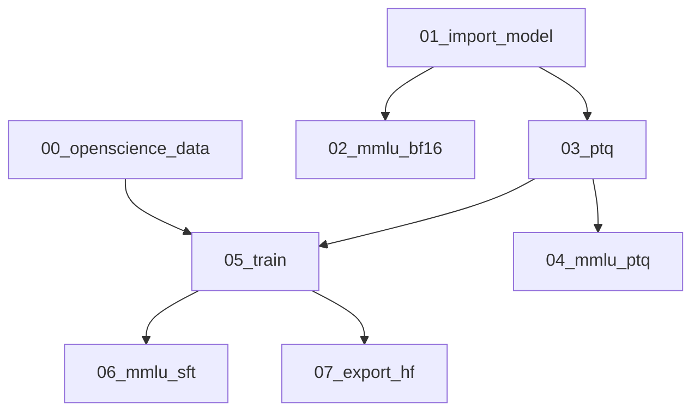

<div align="center">

# NeMo QAT/QAD Simplified Flow Example

[Slurm Examples](ADVANCED.md) |
[Advanced Topics](ADVANCED.md) |
[NeMo Integration](https://github.com/NVIDIA-NeMo/NeMo/tree/main/nemo/collections/llm/modelopt)

</div>

## Overview

This directory contains an end-to-end QAT Simplified Flow example using NeMo for model training. It supports both QAT with cross-entropy loss and QAD (quantization-aware distillation) with knowledge-distillation loss between the BF16 teacher and quantized student models.

After PTQ (post-training quantization), the quantized model may 

## Flow Stages

Currently the Simplified Flow runs the following steps in order:

1. Process Nvidia/OpenScience data (if `--data-path` is not specified)
1. Import NeMo BF16 model checkpoint and evaluate 5% of MMLU on BF16 checkpoint
1. PTQ the model and evaluate 5% of MMLU on PTQ Checkpoint
1. SFT (finetune) the model
1. Evaluate 5% of MMLU on the SFT checkpoint
1. Export model to Unified checkpoint (HuggingFace) format in lower precision


```mermaid
graph TD;
00_openscience_data-->05_train;
01_import_model-->02_mmlu_bf16;
01_import_model-->03_ptq;
03_ptq-->04_mmlu_ptq;
03_ptq-->05_train;
05_train-->06_mmlu_sft;
05_train-->07_export_hf;
```


## Usage

### Prerequisites

You can run the example either locally  or on a [Slurm cluster](ADVANCED.md).

To run the example locally, launch a [NeMo container](https://catalog.ngc.nvidia.com/orgs/nvidia/containers/nemo) with version 25.07 or higher. Clone the `TensorRT-Model-Optimizer` repository and `NeMo` repository (checkout a specific commit for NeMo), then mount it onto your docker container.

- `git clone https://github.com/NVIDIA/TensorRT-Model-Optimizer.git`
- `git clone https://github.com/NVIDIA-NeMo/NeMo.git && cd NeMo && git checkout ddcb75f`

Example docker command:
```
docker run -v  /home/user/:/home/user/ -v /home/user/NeMo:/opt/NeMo -v /home/user/TensorRT-Model-Optimizer/modelopt/:/usr/local/lib/python3.12/dist-packages/modelopt --gpus all -it --shm-size 20g --rm nvcr.io/nvidia/nemo:25.07 bash
```


### Running the Flow Locally

After launching the NeMo container with the specified mounts, follow these examples to run the flow locally.

#### QAT

From the `nemo_run` folder, launch the example with the `qat/nemo_qat_flow.py` script. To use a different model than the default model (Qwen3-8B), you can add the `--model-name <hf-model-name> --finetune-recipe <recipe-name>` flags and use the model's HuggingFace name and NeMo recipe names listed [here](https://github.com/NVIDIA/NeMo/tree/main/nemo/collections/llm/recipes). To provide your own custom dataset, use the `--data-path` flag, otherwise the default [NVIDIA OpenScience](https://huggingface.co/datasets/nvidia/OpenScience) dataset will be used.

To perform QAT, run:

```bash
python qat/nemo_qat_flow.py  --log-dir /my/log/dir --experiment qat_experiment
```

> **_NOTE:_** To enable KV cache quantization, add `--enable-kv-cache` and specify qformat using `--kv-cache-qformat <fp8, nvfp4>`.

#### QAD

In order to train using QAD, launch the example with `python qat/nemo_qat_flow.py --model-name <hf-model-name> --distill`. It will utilize `distillation_recipe` with quantized student model and full precision teacher model to train the quantized model.

To perform QAD training, run:

```bash
python qat/nemo_qat_flow.py --distill --log-dir /my/log/dir --experiment qad_experiment
```


## Supported models

Locally this script currently supports models that can be trained on 1 node with 8 x 80GB GPUs. On Slurm you can configure the number of nodes/gpus for training and PTQ with the following flags: `--train-nodes`, `--train-gpus`, `--ptq-gpus`.

The default configuration works on 1 node with 4 H100 GPUs for PTQ and 8 H100 GPUs for training with the following model:

- **Model**: Qwen3-8B
- **Recipe**: qwen3_8b


### Custom Chat Template

By default the script will use the model/tokenizer's chat template, which may not contain the `` and `` tags around the assistant tokens which are needed to generate the assistant loss mask (see [this PR](https://github.com/huggingface/transformers/pull/30650)). To provide path to a custom chat template, use the `--chat-template <my_template.txt>` flag.

### Dataset limitations
The current QAT recipe has been tuned for the Qwen3-8B model to improve accuracy on the MMLU benchmark after PTQ degradation. QAT/QAD results are highly dependent on the specific model, dataset, and hyperparameters. There is no guarantee that the same dataset will recover the accuracy of the PTQ model. Feel free to try your own model and dataset combinations and test which combination works best.
