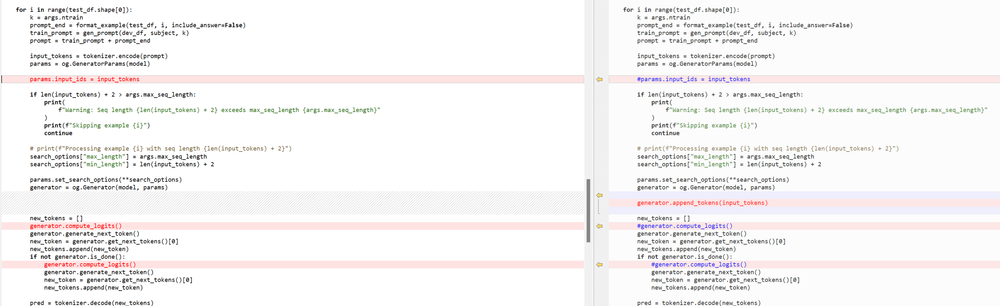

## Table of Contents

- [Overview](#overview)
- [Prerequisites](#prerequisites)
- [Accuracy Benchmarks](#accuracy-benchmarks)
  - [MMLU (Massive Multitask Language Understanding)](#mmlu-massive-multitask-language-understanding)
    - [Setup](#setup)
    - [Evaluation Methods](#evaluation-methods)
- [API changes in ONNX Runtime GenAI v0.6](#api-changes-in-onnx-runtime-genai-v06)
- [Troubleshoot](#troubleshoot)

## Overview

This repository provides scripts, popular third-party benchmarks, and instructions for evaluating the accuracy of Large Language Models (LLMs). It demonstrates how to use a ModelOpt quantized LLM with various established benchmarks, including deployment options using DirectML and TensorRT-LLM in a Windows environment.

## Prerequisites

| **Category** | **Details** |
|:--------------------------|-------------------------------------------------------------------------------------------------------------|
| **Operating System** | Windows 10 or later |
| **Python** | - For ORT-DML GenAI, use Python 3.11. <br> - For TensorRT-LLM, use Python 3.10. <br> - All other backends are compatible with both Python 3.10 and 3.11. |
| **Package Manager** | pip |
| **Compatible Hardware and Drivers** | - Ensure necessary hardware (e.g., CUDA-compatible GPU) and drivers are installed, depending on the evaluation method: <br> - DirectML for DirectML-based evaluation <br> - CUDA for TensorRT |
| **Additional Tools** | - **cmd**: Recommended for running the provided commands. <br> - **Tar Utility**: Included in Windows 10 and later via PowerShell. <br> - **Curl**: Included in Windows 10 and later via PowerShell. |

# Accuracy Benchmarks

## MMLU (Massive Multitask Language Understanding)

The MMLU benchmark assesses LLM performance across a wide range of tasks, producing a score between 0 and 1, where a higher score indicates better accuracy. Please refer the [MMLU Paper](https://arxiv.org/abs/2009.03300) for more details on this.

### Setup

The table below lists the setup steps to prepare your environment for evaluating LLMs using the MMLU benchmark.

| **Step** | **Command** or **Description** |
|----------------------------------------|-------------------------------------------------------------------------------------------------------------------------------------------------------------------------------------------|
| **Open PowerShell as Administrator** | - |
| **Create and Activate a Virtual Environment** <br> _(Optional but Recommended)_ | `python -m venv llm_env` <br> `.\llm_env\Scripts\Activate.ps1` |
| **Install PyTorch and Related Packages** | `pip install torch==2.7.0 torchvision==0.22.0 torchaudio==2.7.0 --index-url https://download.pytorch.org/whl/cu128` |
| **Install ONNX Runtime Packages** | `pip install onnxruntime-directml==1.21.1` <br> `pip install onnxruntime-genai-directml==0.6.0` |
| **Install Benchmark Requirements** | `pip install -r requirements.txt` |
| **Download MMLU Data** | `mkdir data` <br> `curl -o .\data\mmlu.tar https://people.eecs.berkeley.edu/~hendrycks/data.tar` <br> `tar -xf .\data\mmlu.tar -C .\data` <br> `Move-Item .\data\data .\data\mmlu` |

### Evaluation Methods

Once the MMLU benchmark is set up, you can use the `mmlu_benchmark.py` script to evaluate LLMs deployed with various backends. Please refer examples below.

<details>
<summary> MMLU Benchmark with GenAI APIs for ORT-DML Deployment</summary>
<br>

To run the model with ORT-DML using GenAI, use the `--ep genai_dml` argument.

- **Test Suite**

  ```powershell
  python mmlu_benchmark.py `
      --model_name causal `
      --model_path <ONNX_model_folder> `
      --ep genai_dml `
      --output_file <output_log_file.json> `
      --ntrain 5
  ```

- **Specific Subjects**

  ```powershell
  python mmlu_benchmark.py `
      --model_name causal `
      --model_path <ONNX_model_folder> `
      --ep genai_dml `
      --output_file <output_log_file.json> `
      --subject abstract_algebra,anatomy,college_mathematics `
      --ntrain 5
  ```

</details>

<details>
<summary>MMLU Benchmark with ONNX Runtime APIs for DML, CUDA, or CPU Deployment</summary>
<br>

To run the model with ORT-DML, ORT-CUDA or ORT-CPU execution providers, use `--ep ort_dml`, `--ep ort_cuda`, or `--ep ort_cpu` respectively.

- **Test Suite**

  ```powershell
  python mmlu_benchmark.py `
      --model_name causal `
      --model_path <ONNX_model_folder> `
      --ep ort_dml `
      --output_file <output_log_file.json> `
      --ntrain 5
  ```

- **Specific Subjects**

  ```powershell
  python mmlu_benchmark.py `
      --model_name causal `
      --model_path <ONNX_model_folder> `
      --ep ort_dml `
      --output_file <output_log_file.json> `
      --subject abstract_algebra,anatomy,college_mathematics `
      --ntrain 5
  ```

</details>

<details>
<summary>MMLU Benchmark with Transformer APIs for PyTorch Hugging Face Models</summary>
<br>

To evaluate the PyTorch Hugging Face (HF) model, use the `--ep pt` argument.

- **Test Suite**

  ```powershell
  python mmlu_benchmark.py `
      --model_name causal `
      --model_path <ONNX_model_folder> `
      --ep pt `
      --output_file <output_log_file.json> `
      --ntrain 5 `
      --dtype <torch_dtype in model's config.json {float16|bfloat16}>
  ```

- **Specific Subjects**

  ```powershell
  python mmlu_benchmark.py `
      --model_name causal `
      --model_path <ONNX_model_folder> `
      --ep pt `
      --output_file <output_log_file.json> `
      --subject abstract_algebra,anatomy,college_mathematics `
      --ntrain 5 `
      --dtype <torch_dtype in model's config.json {float16|bfloat16}>
  ```

</details>

<details>
<summary>MMLU Benchmark with TensorRT-LLM APIs for TensorRT-LLM Deployment</summary>
<br>

1. **Install TensorRT-LLM and Compatible PyTorch**

   ```powershell
   pip install torch==2.4.0+cu121 --index-url https://download.pytorch.org/whl
   pip install tensorrt_llm==0.12.0 `
       --extra-index-url https://pypi.nvidia.com `
       --extra-index-url https://download.pytorch.org/whl/cu121/torch/
   ```

1. **Run the Benchmark**

   - **Test Suite**

     ```powershell
     python mmlu_benchmark.py `
         --model_name causal `
         --hf_model_dir <hf_model_path> `
         --engine_dir <engine_path> `
         --ep trt-llm `
         --ntrain 5 `
         --output_file result.json
     ```

   - **Specific Subjects**

     ```powershell
     python mmlu_benchmark.py `
         --model_name causal `
         --hf_model_dir <hf_model_path> `
         --engine_dir <engine_path> `
         --ep trt-llm `
         --ntrain 5 `
         --output_file result.json `
         --subject abstract_algebra,anatomy,college_mathematics
     ```

</details>

## API changes in ONNX Runtime GenAI v0.6

In onnxruntime-genai (GenAI) v0.6, `generator.compute_logits()` and `generator_params.input_ids` are deprecated and new API `generator.append_tokens(List: token_ids)` is added (see GenAI [PR-867](https://github.com/microsoft/onnxruntime-genai/pull/867) for details).

So, this MMLU script has been updated accordingly - refer following change-snippet from this MMLU script (left works with GenAI < 0.6, right works with GenAI 0.6+). Make sure to update the MMLU script accordingly (left part) for trying it with GenAI < 0.6.



## Troubleshoot

1. In case of any model specific issue (e.g. in tokenizer or in onnxruntime-genai package etc.), one can try using older GenAI e.g. export the ONNX model with `onnxruntime-genai-directml` 0.4 and `transformers` 4.44.

1. In case of trying out MMLU run of ONNX model through GenAI, make sure that the input model is running fine with GenAI. Onnxruntime-genai has example inference scripts (e.g. see [phi3 example](https://github.com/microsoft/onnxruntime-genai/blob/main/examples/python/phi3-qa.py) script).
